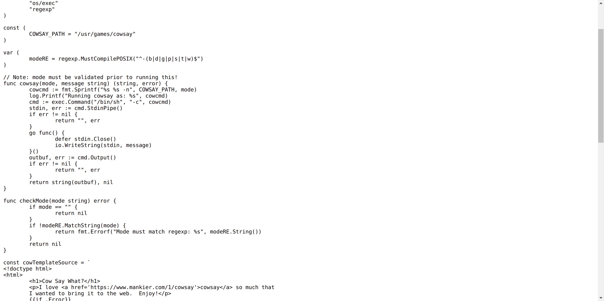
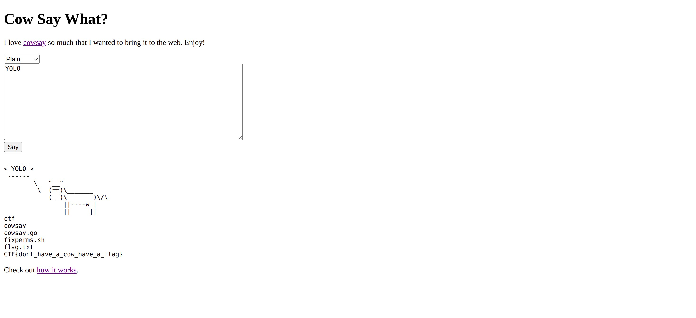

## Cow Say What?
### Category : Web

We have a message box that renders a cow saying what you type in.
It uses the `cowsay` binary to generate the message. Here's the source code.

It uses a regex check on the `mode` variable.

This can be simply bypassed by adding a newline, followed by a command injection.

Exploit : `message=YOLO&mode=-b%0Awhoami%3bls%3bcat+flag.txt%3becho` which is url-encoded new line and whoami, then ls, then cat flag.txt, then echo. The echo is present for a use with `-n`
