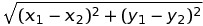

## Broken GPS
### Category : Misc

---

```
Ella is following a broken GPS. The GPS tells her to move in the opposite direction than the one she should be travelling in to get to her destination, and she follows her GPS exactly. For instance, every time she is supposed to move west, the GPS tells her to move east and she does so. Eventually she ends up in a totally different place than her intended location. What is the shortest distance between these two points? Assume that she moves one unit every time a direction is specified. For instance, if the GPS tells her to move "north," she moves one unit north. If the GPS tells her to move "northwest," then she moves one unit north and one unit west.


```

So, the simple language dictates, when the GPS shows North, she is supposed to go South. So with every step, she goes 2 steps in the wrong direction. So, the idea is to mark the actual destination and her location as we move. At the end a simple distance formula is applied. 



Script to parse the input and calculate the distance, gives us the flag.

`exploit.py`
```
import math
import os
import re


def sorted_aphanumeric(data):
    convert = lambda text: int(text) if text.isdigit() else text.lower()
    alphanum_key = lambda key: [ convert(c) for c in re.split('([0-9]+)', key) ] 
    return sorted(data, key=alphanum_key)


def calc_flag(directions):
    final_x=0
    final_y=0

    target_x=0
    target_y=0

    for i in directions[1:]:
        direction = i[:-1]
        if("north" in direction):
            target_y-=1
            final_y+=1
        if("south" in direction):
            target_y+=1
            final_y-=1
        if("east" in direction):
            target_x-=1
            final_x+=1
        if("west" in direction):
            target_x+=1
            final_x-=1

    distance = math.sqrt( ((target_x-final_x)**2)+((target_y-final_y)**2) )
    print(chr(round(distance)%26 + 97),end="")


if __name__ == "__main__":
    files = sorted_aphanumeric(os.listdir("./input"))
    for file in files:
        with open("./input/{}".format(file),"r+") as f:
            directions = f.readlines()
        calc_flag(directions)
```
`output`
```
garminesuckz
```

PS : I didn't know what garmin is and suckz seemed like going in the appropriate direction (pun intended!). So, after a little googling , garmin is American Multination Company that makes GPS Systems. 

`FLAG : hsctf{garminesuckz}`