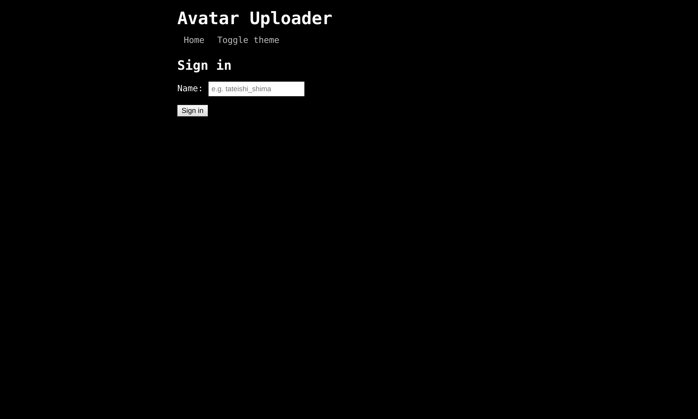
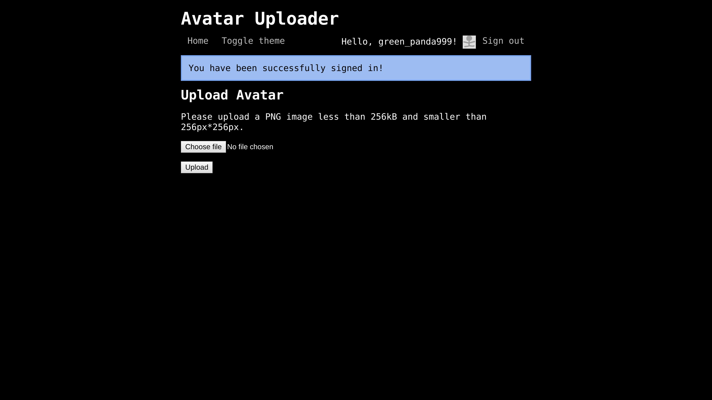
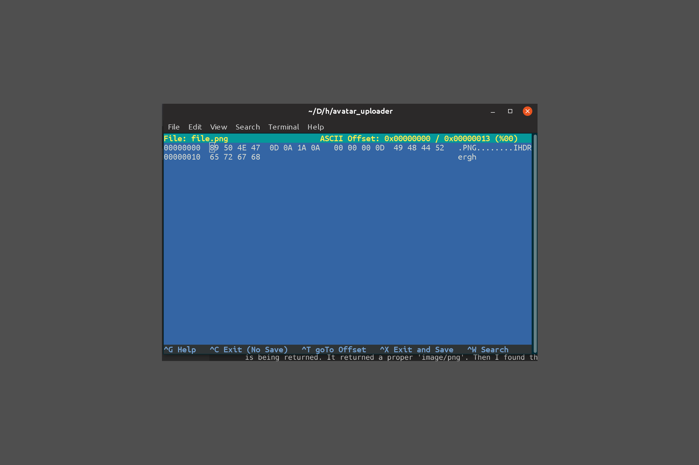
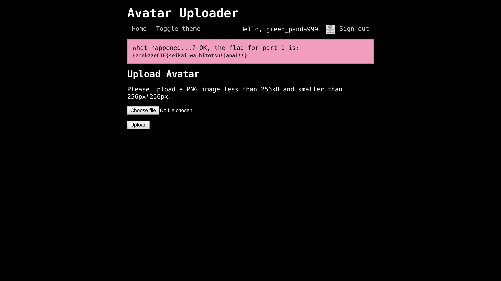

## Avatar Uploader 1
### Category : Misc

---
Could solve both of the challenges after the CTF was over :( . Anyways, had tonnes of fun playing it.


As we visit the site. We are given a login screen.  


On logging in,


Our task is to, upload a `png` file, which is not a `png` file. On viewing the source code.

upload.php
```
<?php
error_reporting(0);

require_once('config.php');
require_once('lib/util.php');
require_once('lib/session.php');

$session = new SecureClientSession(CLIENT_SESSION_ID, SECRET_KEY);

// check whether file is uploaded
if (!file_exists($_FILES['file']['tmp_name']) || !is_uploaded_file($_FILES['file']['tmp_name'])) {
  error('No file was uploaded.');
}

// check file size
if ($_FILES['file']['size'] > 256000) {
  error('Uploaded file is too large.');
}

// check file type
$finfo = finfo_open(FILEINFO_MIME_TYPE);
$type = finfo_file($finfo, $_FILES['file']['tmp_name']);
finfo_close($finfo);
if (!in_array($type, ['image/png'])) {
  error('Uploaded file is not PNG format.');
}

// check file width/height
$size = getimagesize($_FILES['file']['tmp_name']);
if ($size[0] > 256 || $size[1] > 256) {
  error('Uploaded image is too large.');
}
if ($size[2] !== IMAGETYPE_PNG) {
  // I hope this never happens...
  error('What happened...? OK, the flag for part 1 is: <code>' . getenv('FLAG1') . '</code>');
}

// ok
$filename = bin2hex(random_bytes(4)) . '.png';
move_uploaded_file($_FILES['file']['tmp_name'], UPLOAD_DIR . '/' . $filename);

$session->set('avatar', $filename);
flash('info', 'Your avatar has been successfully updated!');
redirect('/');
```

So, first I tried to fool the file into thinking it is `png` file, by changig the extension. But that didn't work. So, I tried changing a jpeg image into png by changing its [magic number](https://en.wikipedia.org/wiki/List_of_file_signatures). But that didn't work either. To go to the bottom off this, I opened a php interactive shell, to see what value is being returned. It returned a proper 'image/png'. Then I found the mistake. PHP versions were wrong. I quickly checked the dockerfile, and updated my php. This time it returned a 'data/octet'.

So the last idea I got was to create a empty file, with just the header. And it worked. 


I used hexeditor, to make the changes.


At last, I uploaded, and it worked.



```
HarekazeCTF{seikai_wa_hitotsu!janai!!}
```