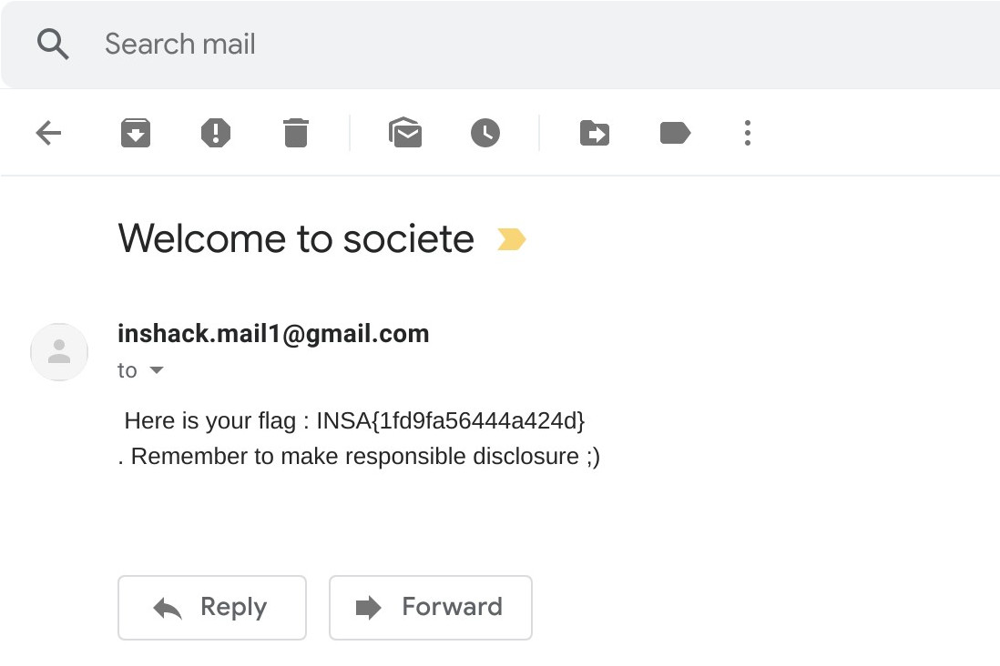

## atchap
### Category : Web

We are given a website, where we have to input a legal mailid, and a mail is sent to the email id, but there are only three legal mail ids, and obviously not a custom mail id.

```
maud.Erateur@almosttchap.fr
guy.Liguili@almosttchap.fr
samira.Bien@almosttchap.fr
```

So, inspired from this [post](https://medium.com/@fs0c131y/tchap-the-super-not-secure-app-of-the-french-government-84b31517d144) by the french hacker Elliot Alderson (@fs0c131y), we can try to bypass the email authentication

We choose any one of the valid email ids and intercept the request in burp. Change it to the following
```
youremail@domain.com@maud.Erateur@almosttchap.fr
```

And Voila!, we get the mail



```
 INSA{1fd9fa56444a424d}
 ```