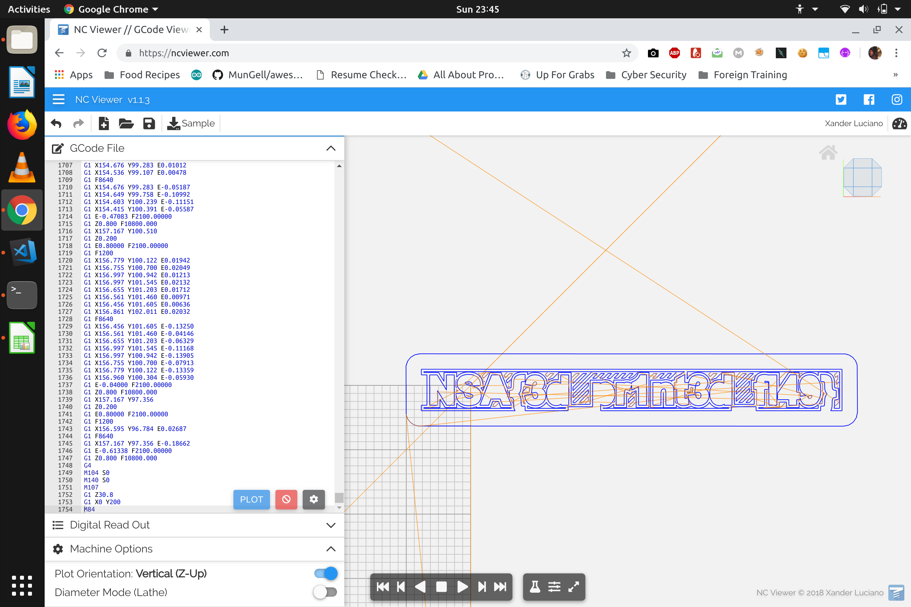

## gFlag
### Category : Misc

The following code is given to us :

```
M73 P0 R2
M201 X9000 Y9000 Z500 E10000
M203 X500 Y500 Z12 E120
M204 P2000 R1500 T2000
M205 X10.00 Y10.00 Z0.20 E2.50
M205 S0 T0
M107
M115 U3.1.0
M83
M204 S2000 T1500
M104 S215
M140 S60
M190 S60
M109 S215
G28 W
G80
...
```
This definitely seems like a [GCode](https://en.wikipedia.org/wiki/G-code).

GCode => GCode is a numerical control (NC) programming language. It is used mainly in computer-aided manufacturing to control automated machine tools.

using a online plotter [NCViewer](https://ncviewer.com/)

we get the following image



The flag ```INSA{3d_pr1nt3d_fl49} ```