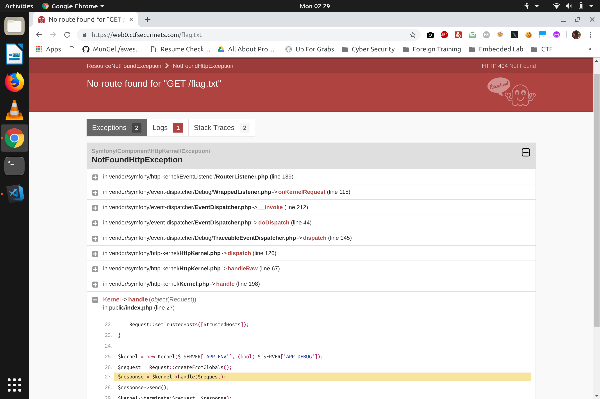

## Custom Location
### Category : Web

We are provided with a [link](https://web0.ctfsecurinets.com/)

First tried accessing /flag.txt

Apparently, the deug mode seems to be turned on and the backend seems to be made using Symphony framework

Let's access the source of index.php

Using the file parameter, we can access config/bootstrap.php

        (new Dotenv())->loadEnv(dirname(__DIR__).'/secret_ctf_location/env');
Seems suspicious

On Accessing /secret_ctf_location/env

We get the flag

    Securinets{D4taB4se_P4sSw0Rd_My5qL_St0L3n}
