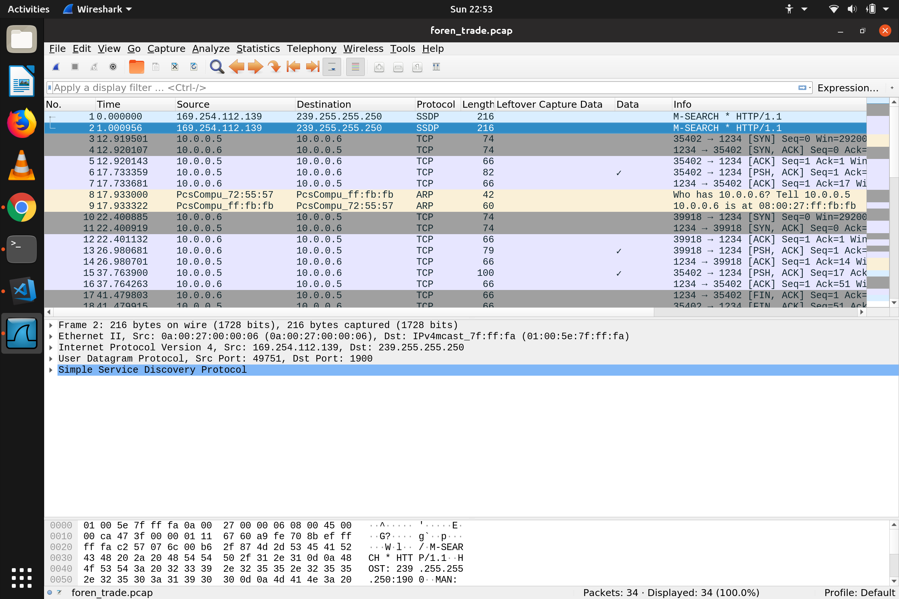
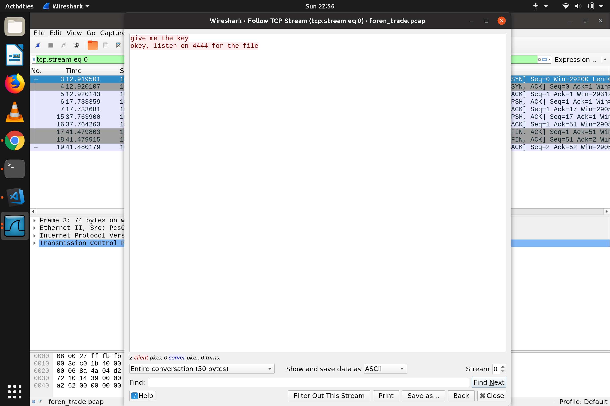
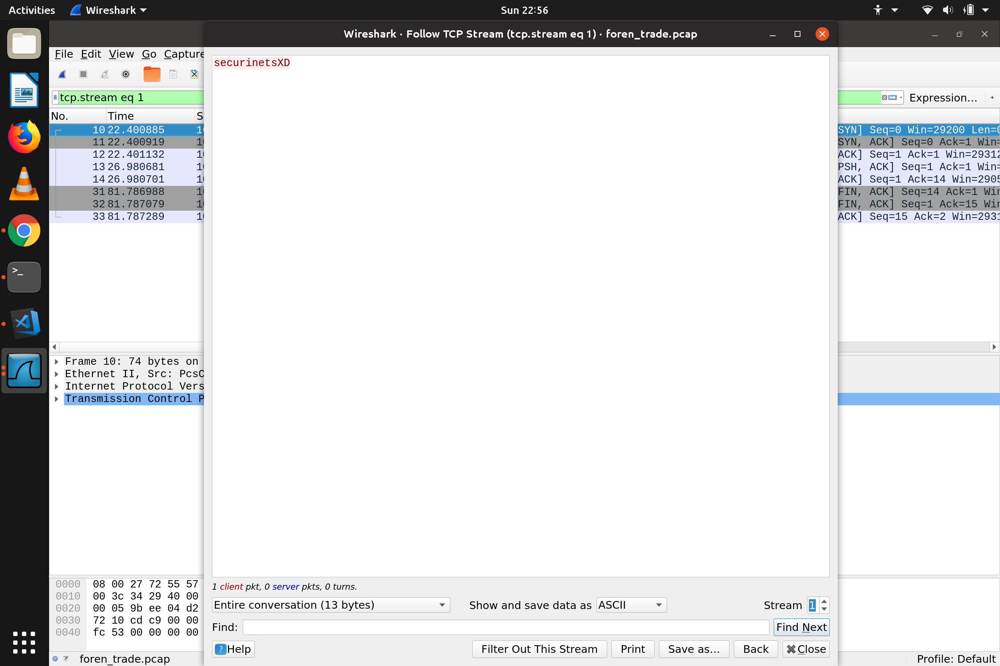
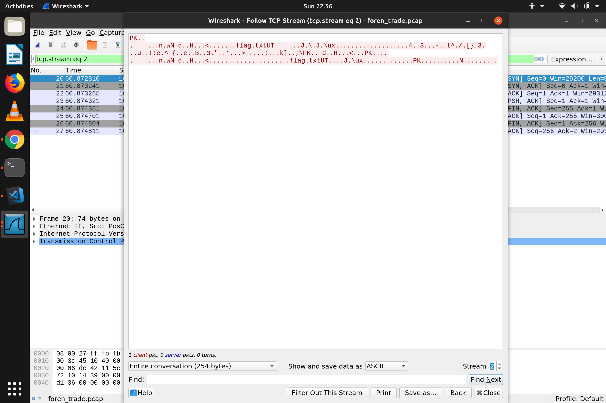

## Easy Trade
### Category : Forensics

We are given a PCAP file with some TCP, etc captured data.  

We first follow a TCP Stream
There are 3 streams available

The 2nd stream looks like some password

The 3rd stream is raw data. Presence of PK.. might indicate the presence of a zip file. Save the raw data as a zip

Unzip it

Use the password from 2nd stream to unzip

We get a base64 encoded stream

    c2VjdXJpbmV0c3s5NTRmNjcwY2IyOTFlYzI3NmIxYTlmZjg0NTNlYTYwMX0

On decoding

    securinets{954f670cb291ec276b1a9ff8453ea601}