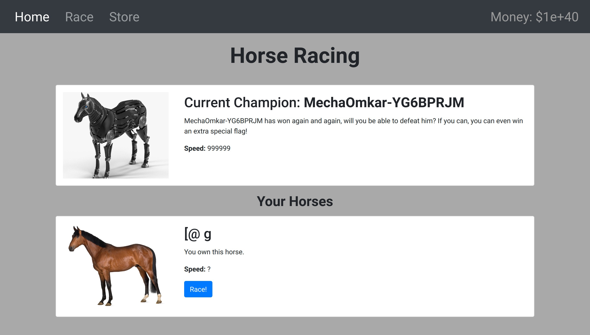
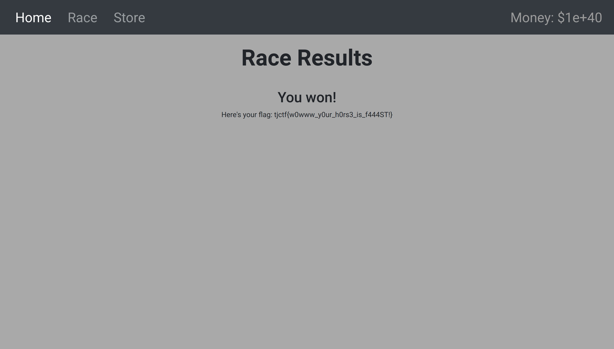

## Moar Horse 4
### Category : Web


TLDR;

JWT Vulnerability.  : [Reference](https://www.nccgroup.com/sg/about-us/newsroom-and-events/blogs/2019/january/jwt-attack-walk-through/)


The idea here, is to create a new JWT cookie, with a modified signature, using the HS256 Algorithm. Since the public key is given to us, this seemed possible.

From the source code, we find that to get the flag, we need to win the race. 

To win the race, the server creates two hashes, one for the Boss's horse and one for our horse. 

I write a script to brute force a new name. 


```
import string
import hashlib

ALLOWED_CHARACTERS = string.printable
NUMBER_OF_CHARACTERS = len(ALLOWED_CHARACTERS)

def characterToIndex(char):
    return ALLOWED_CHARACTERS.index(char)

def indexToCharacter(index):
    if NUMBER_OF_CHARACTERS <= index:
        raise ValueError("Index out of range.")
    else:
        return ALLOWED_CHARACTERS[index]

def next(string):
    """ Get next sequence of characters.
    Treats characters as numbers (0-255). Function tries to increment
    character at the first position. If it fails, new character is
    added to the back of the list.
    It's basically a number with base = 256.
    :param string: A list of characters (can be empty).
    :type string: list
    :return: Next list of characters in the sequence
    :rettype: list
    """
    if len(string) <= 0:
        string.append(indexToCharacter(0))
    else:
        string[0] = indexToCharacter((characterToIndex(string[0]) + 1) % NUMBER_OF_CHARACTERS)
        if characterToIndex(string[0]) is 0:
            return list(string[0]) + next(string[1:])
    return string

def main():
    BOSS_HORSE = "MechaOmkar-YG6BPRJM"
    boss_speed = int(hashlib.md5(("Horse_" + BOSS_HORSE).encode()).hexdigest(), 16)
    sequence = list()
    while True:
        sequence = next(sequence)
        your_speed = int(hashlib.md5(("Horse_"+"".join(sequence)).encode()).hexdigest(), 16)
        if(your_speed>boss_speed):
            print ("".join(sequence),your_speed-boss_speed)

if __name__ == "__main__":
    main()
```

This gives us a new name `[@ g`, with which we modify the new cookie to get the flag.



