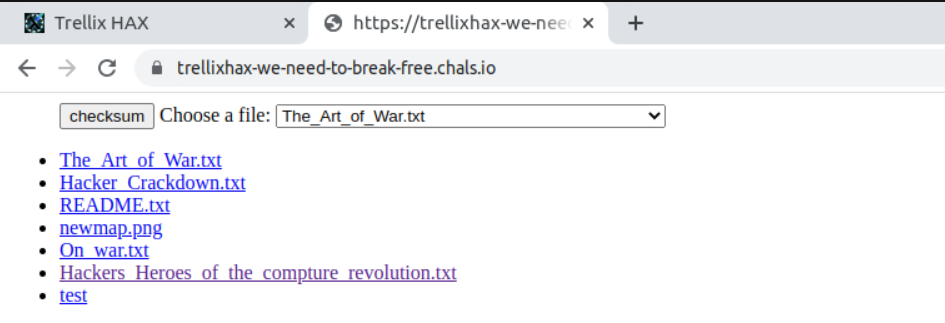
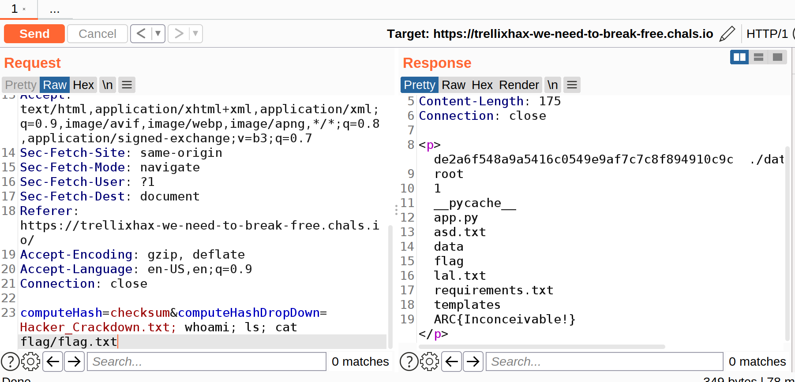

## We need to break free
### Category : Web

We are greeted with the following page :

1. We try the checksum function

2. Intercept the request with burp suite

3. Turns out, we have a Command Injection vulnerability. We can use this to get the flag.

