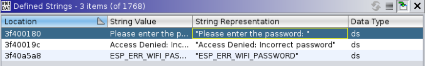
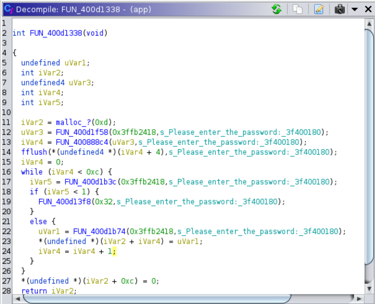
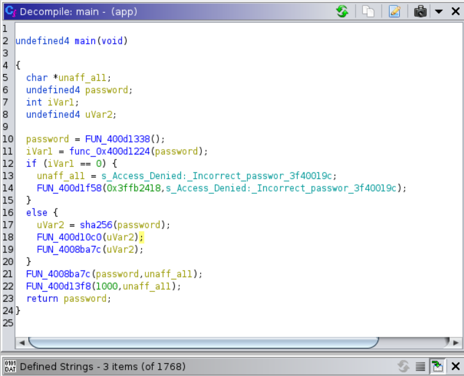
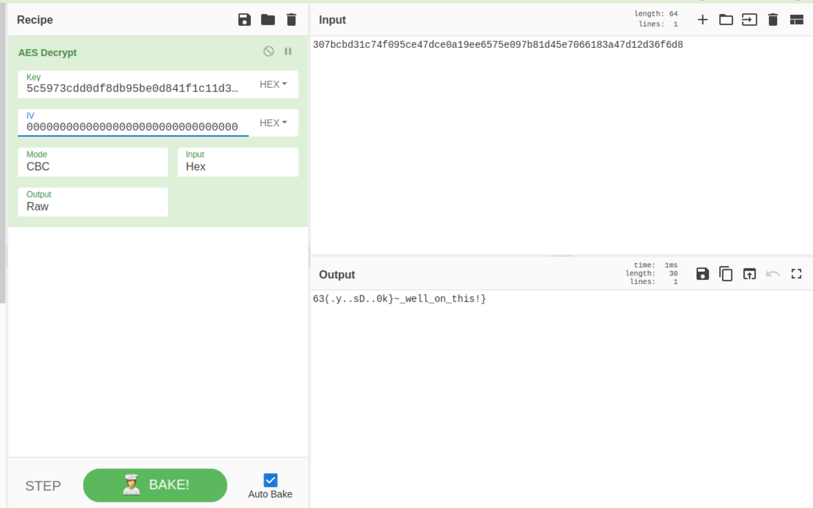
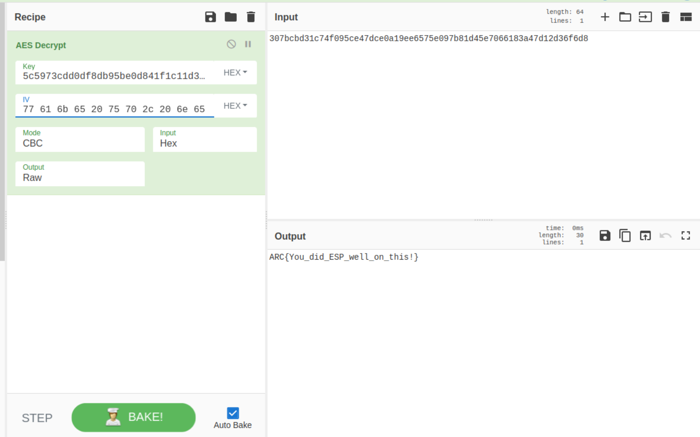

## A Micro what?
### Category : Reverse Engineering

Another reversing challenge. We are giving a flash image (`flash_image.bin`).

```
┌──(greenpanda999㉿zacian)-[~/Desktop/Hax/micro]
└─$ binwalk flash_image.bin 

DECIMAL       HEXADECIMAL     DESCRIPTION
--------------------------------------------------------------------------------
92792         0x16A78         SHA256 hash constants, little endian
97824         0x17E20         AES Inverse S-Box
102176        0x18F20         AES S-Box
1516444       0x17239C        Unix path: /home/runner/work/esp32-arduino-lib-builder/esp32-arduino-lib-builder/esp-idf/components/heap/multi_heap.c
1517468       0x17279C        Unix path: /home/runner/work/esp32-arduino-lib-builder/esp32-arduino-lib-builder/esp-idf/components/heap/multi_heap_poisoning.c

```

Based on binwalk output, it's probably an image for `esp32`.

A quick google search on reversing flash images for esp lead me to [this](https://github.com/BlackVS/ESP32-reversing).

I used [esp32_image_parser](https://github.com/tenable/esp32_image_parser) to exctract an ELF from the data, tho it required some edits to the source. 

Finally, we have `app`

```
┌──(greenpanda999㉿zacian)-[~/Desktop/Hax/micro]
└─$ file app 
app: ELF 32-bit LSB executable, Tensilica Xtensa, version 1 (SYSV), statically linked, not stripped
```
Ghidra doesn't support the Xtensa architecture out of the box. So I had to install [this](https://olof-astrand.medium.com/reverse-engineering-of-esp32-flash-dumps-with-ghidra-or-ida-pro-8c7c58871e68)


Additionally, I found [this](https://olof-astrand.medium.com/reverse-engineering-of-esp32-flash-dumps-with-ghidra-or-ida-pro-8c7c58871e68) article to be particularly helpful.

A lot of function names are missing. So I started with looking for any particular interesting strings.



Finding the xref to the first string led me to this :



Which didn't pan out much, onto the next string.

(Note : Some function names have been renamed while reversing).



By observing the code patterns and some more reversing, we get 

1. Password is compared to a hard-coded password, where password is checked per character.
The hardcoded password is `H@kDaP1@n3t!`.

2. Once correct comparison, this password is hashed using `sha256`, which gives us a 32byte key! 

3. We also know the flag is AES Encrypted. 

4. We find the encrypted flag in the data.

5. Using AES to decrypt, we get

 

Used 0000 for IV. But that only gave half a flag.

6. After further searching, apparently the string `wake up, neo...` was being used for IV.

7. FLAG




`ARC{You_did_ESP_well_on_this!}`