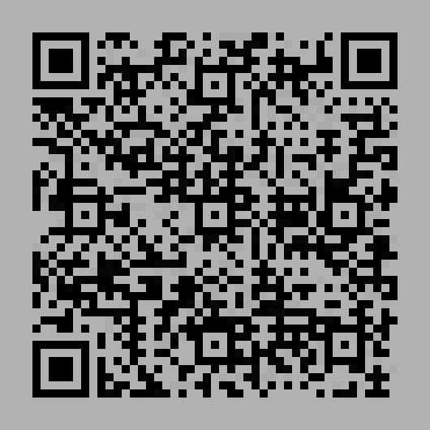
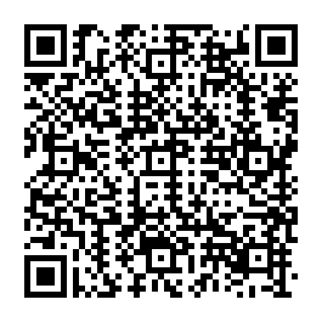

## JOI

### Category : Forensics

We are given a image



On using a mobile QR scanner, we get

```
C_F(n1, n2) = 14 * [C(n1,n2) / 14] + 7 * FLAG(n1,n2) + (C(n1,n2) mod 7)
```
Obviously not the correct Flag

As usual with all Stego Challenges, I used StegoSolve, On Red Plane 0



Decoding with a mobile QR Scanner, we get

```
VolgaCTF{5t3g0_m4tr3shk4_in_4cti0n}
```
